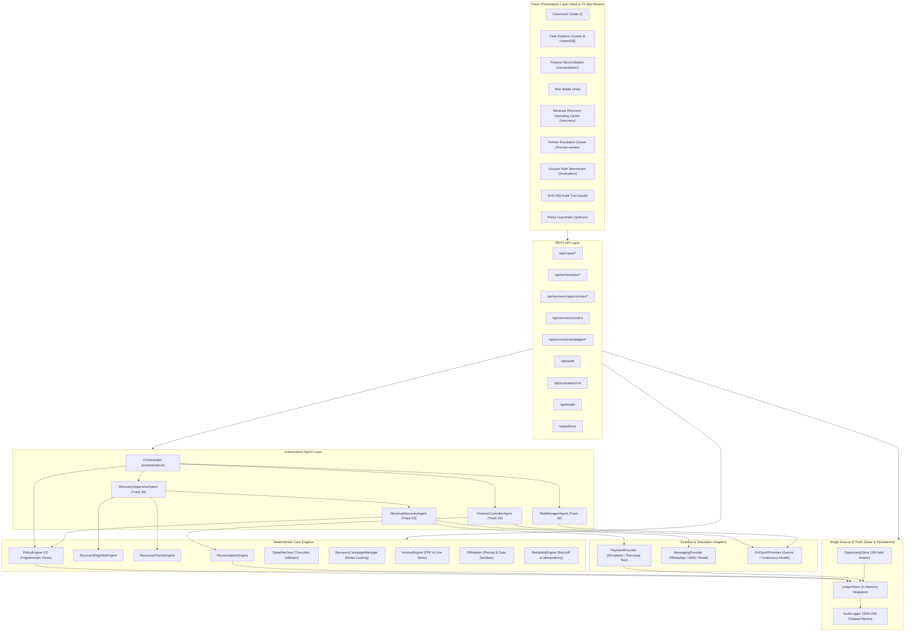
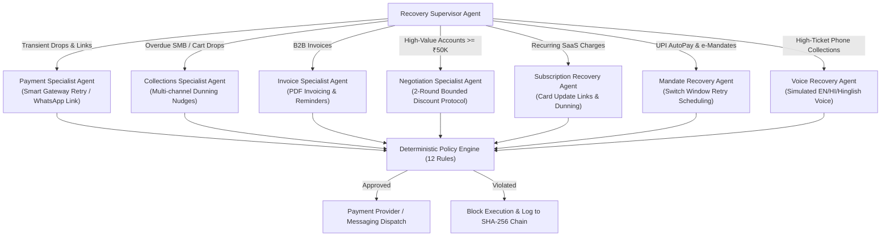
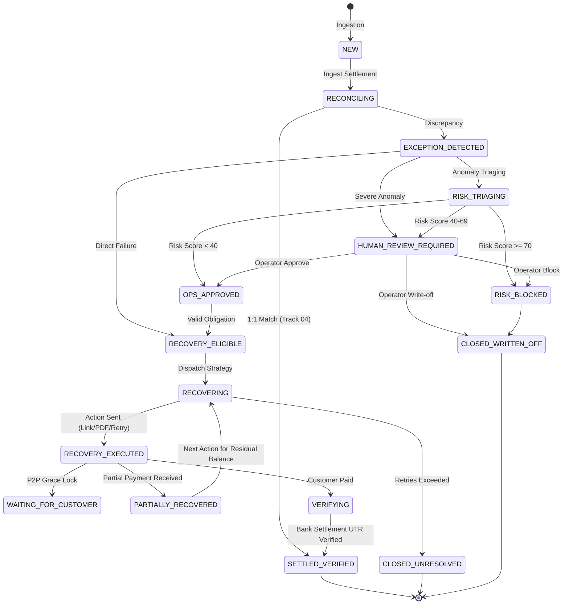

# RAZORRISK.AI — SYSTEM ARCHITECTURE & DIAGRAM SPECIFICATION

> **Document Purpose**: Visual architectural reference, data-flow diagrams, state progression models, agent relationships, and closed-loop verification graphs for RazorRisk.AI.

---

## 1. HIGH-LEVEL SYSTEM ARCHITECTURE



---

## 2. AGENT RELATIONSHIPS & SPECIALIST ROLES



---

## 3. CASE LIFECYCLE & STATE MACHINE GRAPH



---

## 4. TRACK 03 AUTONOMOUS RECOVERY WORKFLOW

```mermaid
flowchart TD
    A[Unmatched Recoverable Exception] --> B[RecoveryEligibilityEngine]
    B -->|Check Risk, Exclusions & Terminal States| C{Is Eligible?}
    C -->|No| D[Mark Ineligible / Blocked]
    C -->|Yes| E[OpportunityStore.createFromCase]
    
    E --> F[RecoveryPriorityEngine (P0-P3)]
    F --> G[Root Cause & Specialist Resolver]
    G --> H[Generate 4-Phase Action Plan\n(CURRENT, NEXT, FALLBACK, STOP)]
    
    H --> I[AI / Specialist Agent Proposal]
    I --> J[Policy Engine Evaluation]
    
    J -->|Pass| K[Dispatch via Provider\n(WhatsApp / SMS / Invoice / Retry)]
    J -->|Block / Clamped| L[Reject Action / Clamp Discount]
    
    K --> M[Customer Response Simulation]
    M -->|Payment Full| N[Transition to VERIFYING]
    M -->|Partial Payment (60%)| O[Record Partial UTR & Invariant\nKeep 40% Remaining Active in Queue]
    M -->|Promise to Pay| P[Lock Grace Period in WAITING_FOR_CUSTOMER]
    M -->|Counter Offer| Q[Negotiation Agent Evaluates Round 2]
    M -->|No Response| R[Switch to Fallback Strategy on Next Cycle]
    
    N --> S[Reconciliation Engine Bank Settlement Check]
    S -->|UTR Matched| T[Transition to SETTLED_VERIFIED\nIncrease Verified Recovered Revenue]
    
    T --> U[Immutable SHA-256 Audit Block]
```

---

## 5. CAMPAIGN CONCURRENCY & MUTEX LOCKING WORKFLOW

```mermaid
flowchart TD
    A[Campaign Manager Trigger] --> B[Filter Eligible Portfolio]
    B --> C[Iterate Candidate Cases]
    
    C --> D{Is Case Already Claimed by\nAnother Active Campaign?}
    D -->|Yes| E[Reject Claim & Skip Case\n(Collision Prevented)]
    D -->|No| F[Acquire Atomic Lock (caseClaims.set)]
    
    F --> G[Execute Specialist Recovery Action]
    G --> H[Update Campaign Metrics\n(Targeted, Recovered, Net, ROI)]
    H --> I[Release Lock on Terminal Resolution]
```

---

## 6. CLOSED-LOOP PAYMENT VERIFICATION PIPELINE

```mermaid
flowchart LR
    A[Customer Action:\nPay via UPI / Card] --> B[Payment Provider:\nPayment Captured]
    B --> C[Case State:\nVERIFYING\n(Not Yet Recovered Cash)]
    C --> D[Bank Settlement Feed:\nIngest Settlement Batch & UTR]
    D --> E[Reconciliation Engine:\nreconcilePair(tx, settlement)]
    E --> F{UTR & Amount Match?}
    F -->|No| G[Hold in VERIFYING\nAlert Finance Queue]
    F -->|Yes| H[Transition to SETTLED_VERIFIED\nAttribute Recovered Revenue]
    H --> I[Append SHA-256 Audit Block]
```

---

## 7. PAGE & NAVIGATION MAP

```mermaid
graph TD
    Root["/ (Command Center Dashboard)"]
    
    Root --> Cases["/cases (Case Explorer)"]
    Cases --> CaseDetail["/cases/[id] (Case 360 Detail View)"]
    
    Root --> Recon["/reconciliation (Track 04: Finance Controller)"]
    Root --> Risk["/risk (Track 02: Risk Radar & Multi-Signal Triage)"]
    
    Root --> Recovery["/recovery (Track 03: Collections Operating Center)"]
    Recovery --> SubPromises["Center: Promise-to-Pay"]
    Recovery --> SubPartials["Center: Partial Collections Ledger"]
    Recovery --> SubInvoices["Center: Invoice Operations"]
    Recovery --> SubLinks["Center: Payment Links"]
    Recovery --> SubAging["Center: B2B Aging Dunning"]
    Recovery --> SubSubs["Center: Subscriptions"]
    Recovery --> SubMandates["Center: UPI Mandates"]
    Recovery --> SubDrops["Center: Checkout Drop-Offs"]
    Recovery --> SubVoice["Center: Voice Simulator"]
    Recovery --> SubNego["Center: Negotiation Protocol"]
    Recovery --> SubCamp["Center: Autonomous Campaigns"]
    
    Root --> Human["/human-review (FinOps Escalation Queue)"]
    Root --> Eval["/evaluation (Ground Truth Benchmark)"]
    Root --> Audit["/audit (Cryptographic Hash Explorer)"]
    Root --> Policies["/policies (Deterministic Guardrails)"]
```



---

## 8. COMPONENT DEPENDENCY MATRIX

```mermaid
graph TD
    subgraph UI Components ["Shared Component Library (src/components/ui/)"]
        RRCard["RRCard"]
        RRButton["RRButton"]
        RRBadge["RRBadge"]
        RRKpiCard["RRKpiCard"]
        RRSection["RRSection"]
        RRFilterBar["RRFilterBar"]
        RRPagination["RRPagination"]
        RREmptyState["RREmptyState"]
    end

    subgraph Pages ["Application Pages"]
        Page_Home["Command Center (/)"]
        Page_Cases["Case Explorer (/cases)"]
        Page_Detail["Case 360 (/cases/[id])"]
        Page_Recon["Reconciliation (/reconciliation)"]
        Page_Risk["Risk Radar (/risk)"]
        Page_Recovery["Recovery Operating Center (/recovery)"]
        Page_Human["Human Review (/human-review)"]
        Page_Audit["Audit Log (/audit)"]
        Page_Eval["Evaluation (/evaluation)"]
        Page_Policies["Policies (/policies)"]
    end

    RRCard --> Page_Home
    RRCard --> Page_Cases
    RRCard --> Page_Detail
    RRCard --> Page_Recon
    RRCard --> Page_Risk
    RRCard --> Page_Recovery
    RRCard --> Page_Human
    RRCard --> Page_Audit
    RRCard --> Page_Eval
    RRCard --> Page_Policies

    RRKpiCard --> Page_Home
    RRKpiCard --> Page_Recon
    RRKpiCard --> Page_Risk
    RRKpiCard --> Page_Recovery
    RRKpiCard --> Page_Eval

    RRButton --> Page_Cases
    RRButton --> Page_Detail
    RRButton --> Page_Recovery
    RRButton --> Page_Human
    RRButton --> Page_Eval
    RRButton --> Page_Policies

    RRBadge --> Page_Cases
    RRBadge --> Page_Detail
    RRBadge --> Page_Recovery
    RRBadge --> Page_Human
    RRBadge --> Page_Risk
```


