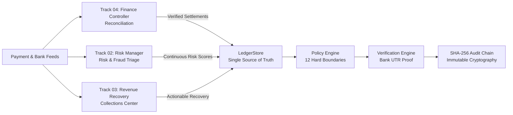
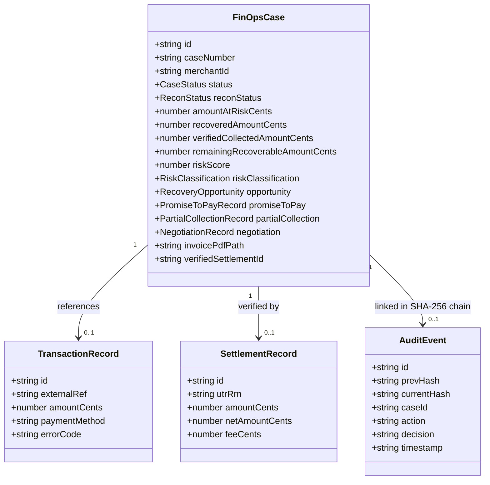
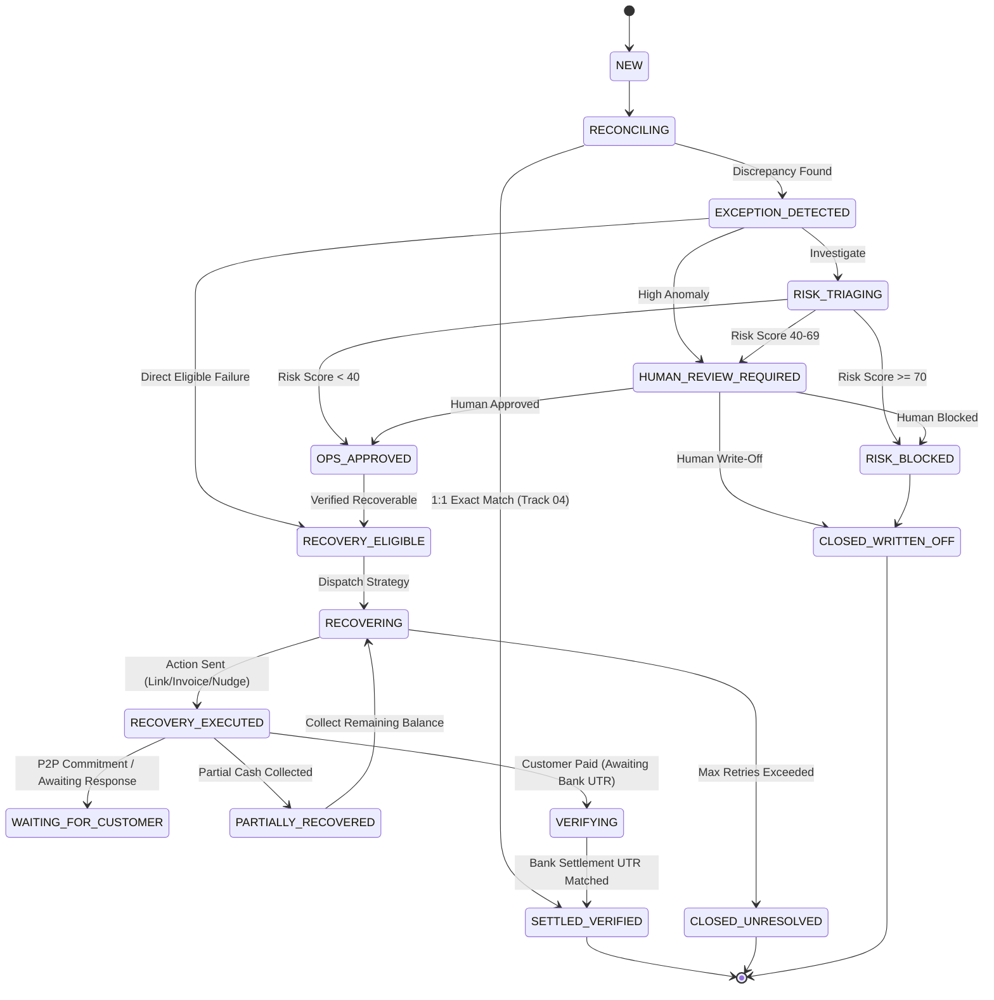
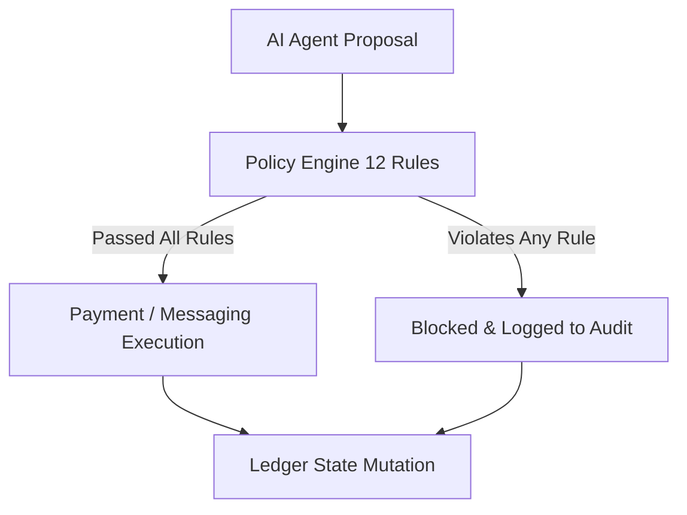

# RAZORRISK.AI — COMPLETE SYSTEM REFERENCE & CODEBASE SPECIFICATION

> **Version**: 1.0.0 (Feature-Complete & Certified Release)  
> **Status**: Feature Freeze — Full Codebase Specification  
> **Core Law**: *LLM Decides. Code Enforces. Ledger Stores State. Reconciliation Verifies Real Outcomes. Audit Log Records Everything.*

---

## 1. PROJECT EXECUTIVE SUMMARY

### What is RazorRisk.AI?
**RazorRisk.AI** is an enterprise-grade autonomous Financial Operations (FinOps), Risk Assessment, and Revenue Recovery platform engineered for modern high-volume payment ecosystems (e.g. Razorpay, UPI, Net Banking, Cards, and B2B Invoicing). It bridges the critical operational gap between raw payment telemetry, fraud/anomaly risk scoring, multi-channel collections, deterministic policy guardrails, and cryptographic audit verification.

### What Problem Does it Solve?
High-growth fintechs and digital merchants process millions of transactions daily across fragmented payment switches, banks, and gateways. When transactions fail, invoices age, or settlements mismatch, traditional systems suffer from:
1. **Manual Reconciliation Overhead**: Days spent resolving MDR fee discrepancies, timing delays, and fuzzy UTR joins.
2. **Disconnected Risk & Collections**: Blindly recovering bad debts without multi-signal fraud screening or aggressive recovery on compromised accounts.
3. **Unbounded Agent Hallucinations**: LLMs offering unauthorized discounts, violating contact cooldowns, or confirming phantom settlements without bank proof.
4. **Lack of Verifiable Accounting Invariants**: Misrepresenting partial collections as fully settled or premature revenue attribution.

RazorRisk.AI solves this through three independent, loosely coupled operational tracks governed by a deterministic programmatic Policy Engine, an immutable SHA-256 audit ledger, and a closed-loop verification pipeline.



### The Three Independent Operational Tracks
* **Track 04: Finance Controller / Reconciliation** (*"What happened to the money?"*): Deterministic 1:1 exact matching, MDR fee netting calculation, fuzzy join investigation, and UTR settlement pairing. Exact matches bypass AI with zero LLM inference cost; ambiguous mismatches trigger structured tool investigation.
* **Track 02: Risk Manager** (*"Is this safe/legitimate?"*): Contextual multi-signal risk assessment computing a continuous 0–100 score based on velocity bursts, device clusters, dispute histories, and card probing. Risk $\ge 70$ strictly blocks recovery; 40–69 escalates to human review; $<40$ clears for operational action.
* **Track 03: Autonomous Revenue Recovery** (*"How should we collect money that is still owed?"*): A multi-agent operating center managing 10 specialist centers (Promise-to-Pay, Partials, Invoices, Payment Links, B2B Aging, Subscriptions, Mandates, Checkout Drops, Voice Simulator, Negotiations). It formulates history-aware adaptive recovery strategies while enforcing strict partial collection accounting and contact cooldowns.

---

## 2. PRODUCT CAPABILITY MAP

| # | Capability | Track | Implementation Status | Primary Component | Source Files | Execution Mode | Provider Status | Notes |
|---|---|---|---|---|---|---|---|---|
| 01 | 1:1 Exact Match Reconciliation | Track 04 | **VERIFIED IMPLEMENTATION** | `ReconciliationEngine` | `src/core/reconciliation/index.ts` | Deterministic (0 AI Cost) | In-Memory / File | Matches externalRef & amount exactly |
| 02 | MDR Fee Netting & Tax Calculation | Track 04 | **VERIFIED IMPLEMENTATION** | `ReconciliationEngine` | `src/core/reconciliation/index.ts` | Deterministic | Internal rules | Computes 1.5%–2.5% fee + 18% GST |
| 03 | Fuzzy UTR / Description Matching | Track 04 | **VERIFIED IMPLEMENTATION** | `ReconciliationEngine` | `src/core/reconciliation/index.ts` | Deterministic / Heuristic | Internal regex | Extracts UTR / RRN tokens |
| 04 | AI Financial Exception Triage | Track 04 | **VERIFIED IMPLEMENTATION** | `FinanceControllerAgent` | `src/agents/finance-controller/index.ts` | Structured AI + Tools | FinOpsAIProvider | Structured JSON output with tools |
| 05 | Continuous Risk Scoring (0–100) | Track 02 | **VERIFIED IMPLEMENTATION** | `FinOpsAIProvider` | `src/core/ai/provider.ts` | Weighted Algorithm + AI | FinOpsAIProvider | Multi-feature continuous score |
| 06 | Device Cluster & Fraud Ring Detection | Track 02 | **VERIFIED IMPLEMENTATION** | `RiskManagerAgent` | `src/agents/risk-manager/index.ts` | Multi-Signal AI + Tools | FinOpsAIProvider | Evaluates device reputation & velocity |
| 07 | Card Probing & Dispute Ratio Analysis | Track 02 | **VERIFIED IMPLEMENTATION** | `RiskManagerAgent` | `src/agents/risk-manager/index.ts` | Multi-Signal AI + Tools | FinOpsAIProvider | Tracks failed cards & chargebacks |
| 08 | First-Class Recovery Opportunity Store | Track 03 | **VERIFIED IMPLEMENTATION** | `OpportunityStore` | `src/core/recovery/opportunity-store.ts` | Deterministic Store | In-Memory Singleton | 28-field asset tracking & lifecycle |
| 09 | Recovery Eligibility Evaluation | Track 03 | **VERIFIED IMPLEMENTATION** | `RecoveryEligibilityEngine` | `src/core/recovery/eligibility-engine.ts` | Deterministic Policy Gate | Internal rules | Excludes exact matches, fees, fraud |
| 10 | Recovery Prioritization (P0–P3) | Track 03 | **VERIFIED IMPLEMENTATION** | `RecoveryPriorityEngine` | `src/core/recovery/priority-engine.ts` | Deterministic Math | Internal rules | Multi-factor amount/overdue scoring |
| 11 | Specialist Agent Routing | Track 03 | **VERIFIED IMPLEMENTATION** | `RecoverySupervisorAgent` | `src/agents/recovery-supervisor/index.ts` | Deterministic Architecture | Internal rules | Routes to 8 specialist roles |
| 12 | Adaptive Multi-Channel Contact | Track 03 | **VERIFIED IMPLEMENTATION** | `RevenueRecoveryAgent` | `src/agents/revenue-recovery/index.ts` | Adaptive Agent + History | Messaging Adapter | WhatsApp, Email, SMS, Retries |
| 13 | Smart Payment Gateway Retries | Track 03 | **VERIFIED IMPLEMENTATION** | `PaymentAgent` | `src/agents/revenue-recovery/index.ts` | Deterministic + Backoff | Payment Provider | Exponential backoff with jitter |
| 14 | Instant Payment Links (UPI / Web) | Track 03 | **VERIFIED IMPLEMENTATION** | `PaymentAgent` | `src/core/payment-provider/` | Hybrid / Pluggable | Simulation / Razorpay Test | Tracks Created $\rightarrow$ Paid |
| 15 | B2B Commercial Invoicing & PDF | Track 03 | **VERIFIED IMPLEMENTATION** | `InvoiceAgent` / `InvoiceEngine` | `src/core/documents/invoice-generator.ts` | Deterministic Generator | Internal PDF / HTML | GSTIN, Line items, Payment links |
| 16 | Bounded 2-Round Negotiation | Track 03 | **VERIFIED IMPLEMENTATION** | `NegotiationAgent` | `src/agents/revenue-recovery/index.ts` | Structured AI + Policy Gate | Internal Policy | Max 10% discount, min 85% floor |
| 17 | Promise-to-Pay Grace Period Engine | Track 03 | **VERIFIED IMPLEMENTATION** | `OpportunityStore` / `LedgerStore` | `src/core/recovery/opportunity-store.ts` | Deterministic State | Internal Store | Auto-recycles on broken promise |
| 18 | Partial Collection Invariant Accounting | Track 03 | **VERIFIED IMPLEMENTATION** | `OpportunityStore` / `LedgerStore` | `src/core/recovery/opportunity-store.ts` | Deterministic Ledger | Internal Store | $V_{\text{col}} + R_{\text{rem}} = O_{\text{orig}}$ |
| 19 | Multilingual Voice Simulator | Track 03 | **VERIFIED IMPLEMENTATION** | `VoiceRecoveryAgent` | `src/agents/revenue-recovery/index.ts` | **SIMULATION** (EN/HI/Hinglish) | Internal NLP Parser | Labeled "SIMULATED VOICE" |
| 20 | Subscription Dunning Recovery | Track 03 | **VERIFIED IMPLEMENTATION** | `SubscriptionRecoveryAgent` | `src/core/recovery/playbooks.ts` | Deterministic Playbook | Simulation / Provider | Card update link + dunning cycles |
| 21 | UPI AutoPay & Mandate Recovery | Track 03 | **VERIFIED IMPLEMENTATION** | `MandateRecoveryAgent` | `src/core/recovery/playbooks.ts` | Deterministic Playbook | Simulation / Provider | Switch window alignment |
| 22 | Cart Drop-Off Checkout Recovery | Track 03 | **VERIFIED IMPLEMENTATION** | `CollectionsAgent` | `src/core/recovery/playbooks.ts` | Deterministic Playbook | Messaging Adapter | 1-Click WhatsApp cart nudges |
| 23 | B2B Aging Dunning Buckets | Track 03 | **VERIFIED IMPLEMENTATION** | `OpportunityStore` | `src/core/recovery/opportunity-store.ts` | Deterministic Bucketing | Internal Store | 15–30d, 31–60d, 61–90d, 90+d |
| 24 | Autonomous Campaigns & Mutex Lock | Track 03 | **VERIFIED IMPLEMENTATION** | `RecoveryCampaignManager` | `src/core/recovery/campaign-manager.ts` | Autonomous Simulation Loop | Internal Store | Atomic case claiming lock |
| 25 | 12 Hard Deterministic Policy Rules | Core | **VERIFIED IMPLEMENTATION** | `PolicyEngine` | `src/core/policy-engine/index.ts` | Deterministic Programmatic | Internal Engine | Immutable programmatic boundary |
| 26 | FinOps Human Escalation Queue | Core | **VERIFIED IMPLEMENTATION** | UI / API Handler | `src/app/human-review/page.tsx` | Human-in-the-Loop | API Route | Approve, Block, Override, Write-Off |
| 27 | SHA-256 Cryptographic Audit Chain | Core | **VERIFIED IMPLEMENTATION** | `AuditLogger` | `src/core/audit/audit-logger.ts` | Cryptographic Hash Chain | Node.js `crypto` | Tamper-evident linking from Genesis |
| 28 | Closed-Loop Settlement Verification | Core | **VERIFIED IMPLEMENTATION** | `Orchestrator` / `ReconEngine` | `src/agents/orchestrator.ts` | Bank Settlement UTR Join | Internal Store | Cash counted only upon bank credit |
| 29 | Synthetic Financial Universe (50K+) | Data | **VERIFIED IMPLEMENTATION** | `DatasetGenerator` | `src/data/synthetic/` | Seeded PRNG Generator | Pure Deterministic | 48 scenario families, noise, rings |
| 30 | Cryptographic Ground Truth Isolation | Eval | **VERIFIED IMPLEMENTATION** | `GroundTruthIsolation` | `src/core/evaluation/ground-truth-isolation.ts` | Cryptographic Boundary | Pure In-Memory | Strips ground truth labels |
| 31 | Empirical Benchmark Runner | Eval | **VERIFIED IMPLEMENTATION** | `BenchmarkRunner` | `src/core/evaluation/benchmark.ts` | Isolated Computation Loop | Pure In-Memory | Precision, Recall, F1, Net Recovery |
| 32 | Razorpay Test API Adapter | Provider | **VERIFIED IMPLEMENTATION** | `RazorpayTestPaymentAdapter` | `src/core/payment-provider/razorpay-adapter.ts` | Test Mode / REST API | Razorpay Sandbox API | HMAC SHA-256 webhook check |
| 33 | Fault Injection Simulation Adapter | Provider | **VERIFIED IMPLEMENTATION** | `SimulationPaymentAdapter` | `src/core/payment-provider/simulation-adapter.ts` | Fault Injection Simulation | In-Memory Sim | Injects 504 timeouts, 500 errors |
| 34 | Deep Diagnostic Health System | Core | **VERIFIED IMPLEMENTATION** | `HealthCheckService` | `src/core/health/health-check.ts` | Diagnostic Monitor | In-Memory / Runtime | Subsystem health & telemetry |

---

## 3. COMPLETE ARCHITECTURE SPECIFICATION

```mermaid
graph TD
    subgraph Client Layer [Browser / Client Layer]
        UI_Home["/ (Command Center)"]
        UI_Cases["/cases & /cases/[id] (Case Explorer)"]
        UI_Recon["/reconciliation (Track 04)"]
        UI_Risk["/risk (Track 02)"]
        UI_Recovery["/recovery (Track 03 Operating Center)"]
        UI_Human["/human-review (Escalations)"]
        UI_Audit["/audit (SHA-256 Trail)"]
        UI_Eval["/evaluation (Benchmark)"]
        UI_Policy["/policies (Guardrails)"]
    end

    subgraph API Layer [Next.js 15 Route Handlers]
        API_Cases["/api/cases & /api/cases/[id]"]
        API_Recon["/api/orchestrator/run"]
        API_Human["/api/orchestrator/human-action"]
        API_RecoveryOpps["/api/recovery/opportunities/*"]
        API_Centers["/api/recovery/centers"]
        API_Campaigns["/api/recovery/campaigns/*"]
        API_Audit["/api/audit"]
        API_Eval["/api/evaluation/run"]
        API_Health["/api/health"]
        API_Policy["/api/policies"]
    end

    subgraph Orchestration Layer [Agentic Orchestration & Supervisors]
        Orchestrator["Orchestrator (src/agents/orchestrator.ts)"]
        FinanceAgent["FinanceControllerAgent (Track 04)"]
        RiskAgent["RiskManagerAgent (Track 02)"]
        RecoverySup["RecoverySupervisorAgent (Track 03)"]
        RevenueAgent["RevenueRecoveryAgent (Track 03)"]
    end

    subgraph Core Engines [Deterministic Programmatic Engines]
        ReconEngine["ReconciliationEngine"]
        EligibilityEngine["RecoveryEligibilityEngine"]
        PriorityEngine["RecoveryPriorityEngine"]
        PolicyEngine["PolicyEngine (12 Rules)"]
        StateMachine["StateMachine"]
        CampaignMgr["RecoveryCampaignManager"]
        InvoiceGen["InvoiceEngine"]
        PIIMasker["PIIMasker"]
    end

    subgraph State & Persistence Layer [Single Source of Truth]
        LedgerStore["LedgerStore (In-Memory Singleton)"]
        OpportunityStore["OpportunityStore (First-Class Opportunities)"]
        AuditLogger["AuditLogger (SHA-256 Chained Blocks)"]
    end

    subgraph Provider & Simulation Layer [Payment & Messaging Abstraction]
        PayAdapter["PaymentProvider (Simulation / Razorpay Test)"]
        MsgAdapter["MessagingProvider (WhatsApp / SMS / Email Simulation)"]
        AIProvider["FinOpsAIProvider (Synthesis / Continuous Scoring)"]
    end

    subgraph Data & Evaluation Universe [Synthetic Universe & Benchmark]
        DataGen["DatasetGenerator (50K+ FinOps Scenarios)"]
        Benchmark["BenchmarkRunner"]
        Isolation["GroundTruthIsolation (Anti-Leakage Guard)"]
    end

    Client Layer --> API Layer
    API Layer --> Orchestrator
    API Layer --> RecoverySup
    API Layer --> LedgerStore
    API Layer --> OpportunityStore
    API Layer --> CampaignMgr
    API Layer --> PolicyEngine
    API Layer --> AuditLogger

    Orchestrator --> FinanceAgent
    Orchestrator --> RiskAgent
    Orchestrator --> RecoverySup
    Orchestrator --> PolicyEngine
    Orchestrator --> ReconEngine

    FinanceAgent --> ReconEngine
    FinanceAgent --> AIProvider
    RiskAgent --> AIProvider
    RecoverySup --> EligibilityEngine
    RecoverySup --> PriorityEngine
    RecoverySup --> RevenueAgent
    RevenueAgent --> PolicyEngine
    RevenueAgent --> PayAdapter
    RevenueAgent --> MsgAdapter

    PolicyEngine --> LedgerStore
    ReconEngine --> LedgerStore
    PayAdapter --> LedgerStore
    LedgerStore --> AuditLogger
    OpportunityStore --> LedgerStore

    Benchmark --> Isolation
    Isolation --> DataGen
    Benchmark --> AIProvider
```

---

## 4. DIRECTORY & REPOSITORY TREE

```
RazorRisk.AI/
├── src/
│   ├── agents/                     # Autonomous specialist agents & orchestrator
│   │   ├── finance-controller/     # Track 04: Reconciliation exception triage
│   │   ├── risk-manager/           # Track 02: Multi-signal risk assessment
│   │   ├── recovery-supervisor/    # Track 03: Specialist routing & portfolio discovery
│   │   ├── revenue-recovery/       # Track 03: Multi-channel recovery & negotiation
│   │   └── orchestrator.ts         # Closed-loop end-to-end FinOps pipeline
│   ├── app/                        # Next.js 15 App Router pages & API routes
│   │   ├── api/                    # 14 REST API endpoint handlers
│   │   ├── audit/                  # /audit (Cryptographic audit log)
│   │   ├── cases/                  # /cases & /cases/[id] (Case Explorer & 360 Detail)
│   │   ├── evaluation/             # /evaluation (Benchmark runner & scorecard)
│   │   ├── human-review/           # /human-review (Human escalation queue)
│   │   ├── policies/               # /policies (Policy configuration)
│   │   ├── reconciliation/         # /reconciliation (Track 04 Workspace)
│   │   ├── recovery/               # /recovery (Track 03 Operating Center)
│   │   ├── risk/                   # /risk (Track 02 Workspace)
│   │   ├── layout.tsx              # Root shell layout with navigation
│   │   ├── page.tsx                # / (Command Center Dashboard)
│   │   └── globals.css             # Enterprise design system CSS variables
│   ├── components/                 # Reusable UI component library
│   │   ├── layout/                 # Header & Sidebar navigation
│   │   └── ui/                     # RRCard, RRButton, RRBadge, RRKpiCard, etc.
│   ├── core/                       # Core fintech domain logic and engines
│   │   ├── ai/                     # AI provider abstraction, prompts, schemas
│   │   ├── audit/                  # SHA-256 immutable chained block logger
│   │   ├── documents/              # Invoice generator & PDF synthesis
│   │   ├── evaluation/             # Benchmark runner & ground truth isolation
│   │   ├── health/                 # Diagnostics & health check monitor
│   │   ├── ledger/                 # LedgerStore in-memory single source of truth
│   │   ├── messaging-provider/     # WhatsApp / SMS / Email messaging adapters
│   │   ├── metrics/                # Metric dictionary & KPI calculators
│   │   ├── payment-provider/       # Razorpay test adapter & fault injection
│   │   ├── policy-engine/          # 12 deterministic guardrail rules
│   │   ├── reconciliation/         # ReconciliationEngine (Exact, Fee, Fuzzy)
│   │   ├── recovery/               # OpportunityStore, CampaignManager, Playbooks
│   │   ├── reliability/            # Exponential backoff, jitter, idempotency
│   │   ├── security/               # PII masker & red-team sanitizer
│   │   └── state-machine/          # Formal state transition graph & validator
│   ├── data/                       # Synthetic financial data universe
│   │   └── synthetic/              # 48 scenario families, PRNG, fraud rings
│   └── types/                      # TypeScript domain definitions (986 lines)
│       └── index.ts
├── tests/                          # Automated Vitest test suite (427 tests)
│   ├── eval/                       # 17 evaluation and E2E benchmark suites
│   ├── integration/                # 1 API route integration test suite
│   └── unit/                       # 16 unit test suites
├── package.json                    # Dependencies and npm scripts
├── tsconfig.json                   # TypeScript configuration
└── vitest.config.ts                # Vitest test runner configuration
```

---

## 5. SOURCE FILE INVENTORY

### `src/agents/`
1. **`src/agents/orchestrator.ts`**: Coordinates end-to-end FinOps case lifecycle (`runFullPipeline`, `executeRecoveryOnly`, `executeHumanAction`). Connects reconciliation, risk, recovery, verification, and audit.
2. **`src/agents/finance-controller/index.ts`**: Finance Controller Agent. Performs exact match bypass (zero AI cost), extracts fee deductions, and calls structured AI tools for ambiguous joins.
3. **`src/agents/finance-controller/tools.ts`**: Tool definitions for `getSettlementCandidates`, `computeFeeDeductions`, `lookupHistoricalMdrRate`.
4. **`src/agents/risk-manager/index.ts`**: Risk Manager Agent. Gathers multi-signal features (velocity, device clusters, dispute ratios, card probing) and generates structured risk decisions.
5. **`src/agents/risk-manager/tools.ts`**: Tool definitions for `getCustomerRiskHistory`, `getVelocitySignals`, `getDeviceReputation`, `getCardProbingSignals`.
6. **`src/agents/recovery-supervisor/index.ts`**: Recovery Supervisor Agent. Evaluates portfolio eligibility, assigns priority tiers, routes to specialist roles, executes recovery actions, and verifies settlements.
7. **`src/agents/revenue-recovery/index.ts`**: Revenue Recovery Agent. Handles adaptive retry, payment link dispatch, B2B bounded 2-round negotiation, and customer response simulation.
8. **`src/agents/revenue-recovery/tools.ts`**: Tool definitions for `initiateRecovery`, `sendPaymentLink`, `negotiateSettlement`, `registerPromiseToPay`, `recordPartialPayment`.

### `src/core/`
9. **`src/core/reconciliation/index.ts`**: `ReconciliationEngine`. Executes deterministic 1:1 exact matching, MDR fee calculation (1.5%–2.5% + 18% GST), fuzzy description parsing, and settlement UTR pairing.
10. **`src/core/policy-engine/index.ts`**: `PolicyEngine`. Enforces 12 immutable programmatic guardrail rules (max 10% discount, min 85% settlement floor, max 3 retries, 4-hour cooldown, ₹50,000 auto-recovery cap).
11. **`src/core/state-machine/index.ts`**: `StateMachine`. Formal state transition graph validator preventing illegal case mutations.
12. **`src/core/ledger/ledger-store.ts`**: `LedgerStore`. Thread-safe in-memory singleton storing transactions, settlements, FinOps cases, risk assessments, recovery records, and audit links.
13. **`src/core/recovery/opportunity-store.ts`**: `OpportunityStore`. First-class recovery opportunity domain store managing 28-field records, root-cause resolution, dynamic action plans, and 10 operating center metrics.
14. **`src/core/recovery/campaign-manager.ts`**: `RecoveryCampaignManager`. Manages autonomous segment-targeted recovery campaigns with atomic mutex case-claim locks.
15. **`src/core/recovery/eligibility-engine.ts`**: `RecoveryEligibilityEngine`. Evaluates whether a financial discrepancy represents an actionable obligation.
16. **`src/core/recovery/priority-engine.ts`**: `RecoveryPriorityEngine`. Multi-factor prioritization algorithm assigning `P0`, `P1`, `P2`, or `P3` tiers.
17. **`src/core/recovery/playbooks.ts`**: Specialist recovery playbooks for failed payments, checkout drops, subscriptions, mandates, and overdue invoices.
18. **`src/core/audit/audit-logger.ts`**: `AuditLogger`. Tamper-evident sequential SHA-256 hash-chained block logger.
19. **`src/core/ai/provider.ts`**: `FinOpsAIProvider`. Unified AI abstraction supporting Google Gemini / Anthropic models with offline deterministic fallback and continuous feature-weighted risk scoring.
20. **`src/core/ai/prompts.ts`**: Versioned system prompts for Finance Controller, Risk Manager, and Revenue Recovery agents.
21. **`src/core/evaluation/benchmark.ts`**: `BenchmarkRunner`. Evaluates precision, recall, F1, false positive cost, and net recovery against hidden ground truth.
22. **`src/core/evaluation/ground-truth-isolation.ts`**: `GroundTruthIsolation`. Strips scenario labels and ground truth metadata before passing data to agents.
23. **`src/core/documents/invoice-generator.ts`**: `InvoiceEngine`. Generates structured commercial invoices with line items, tax netting, and simulated PDF paths.
24. **`src/core/payment-provider/razorpay-adapter.ts`**: `RazorpayTestPaymentAdapter`. Razorpay sandbox test-mode integration with HMAC SHA-256 webhook verification.
25. **`src/core/payment-provider/simulation-adapter.ts`**: `SimulationPaymentAdapter`. Fault injection simulation engine for timeouts, network drops, and bank declines.
26. **`src/core/security/pii-masker.ts`**: `PIIMasker`. Masks card numbers, emails, phone numbers, and sanitizes prompt injection payloads.
27. **`src/core/reliability/retry-policy.ts`**: `ReliabilityEngine`. Exponential backoff, jitter, and idempotency key manager.
28. **`src/core/health/health-check.ts`**: `HealthCheckService`. Comprehensive diagnostic health and telemetry monitor.

### `src/data/synthetic/`
29. **`src/data/synthetic/dataset-generator.ts`**: `DatasetGenerator`. Generates large-scale synthetic financial worlds (up to 50,000+ cases) with configurable train/validation/test splits.
30. **`src/data/synthetic/scenario-definitions.ts`**: Defines 48 scenario families across normal operations, benign anomalies, recoverable failures, and adversarial fraud patterns.
31. **`src/data/synthetic/entity-generator.ts`**: Synthesizes realistic merchants, customer profiles, device fingerprints, and fraud syndicate clusters.
32. **`src/data/synthetic/noise-engine.ts`**: Injects realistic real-world noise: fee netting, timestamp drift, narration corruption, and bank delay.
33. **`src/data/synthetic/prng.ts`**: Deterministic Seeded Pseudo-Random Number Generator (`AleaPRNG`).

---

## 6. COMPLETE DOMAIN MODEL

```typescript
// Core Financial Entities
export interface TransactionRecord {
  id: string;
  merchantId: string;
  externalRef: string; // Gateway Order ID or Bank UTR
  amountCents: number;
  currency: string;
  paymentMethod: string;
  customerName: string;
  customerEmail?: string;
  customerPhone?: string;
  customerSegment?: 'ENTERPRISE' | 'MID_MARKET' | 'SMB' | 'CONSUMER';
  gatewayCode?: string;
  errorCode?: string;
  errorDescription?: string;
  daysOverdue?: number;
  status: 'CAPTURED' | 'FAILED' | 'REFUNDED' | 'DISPUTED' | 'SUCCESS' | 'PENDING';
  metadata?: Record<string, any>;
  createdAt: string;
}

export interface SettlementRecord {
  id: string;
  batchId: string;
  utrRrn: string; // Bank UTR or RRN
  amountCents: number;
  feeCents: number;
  taxCents: number;
  netAmountCents: number;
  currency: string;
  bankTimestamp: string;
  rawDescription: string;
  reconciledStatus?: ReconStatus;
  createdAt: string;
}

// First-Class Recovery Opportunity
export interface RecoveryOpportunity {
  id: string;
  merchantId: string;
  caseId: string;
  caseNumber: string;
  customerId: string;
  customerName: string;
  customerEmail?: string;
  customerPhone?: string;
  customerSegment: CustomerSegment;
  behaviorSegment: CustomerBehaviorSegment;
  invoiceId?: string;
  transactionId?: string;
  sourceType: RecoverySourceType;
  rootCauseReason?: string;
  amountAtRiskCents: number;
  recoverableAmountCents: number;
  remainingAmountCents: number;
  verifiedCollectedCents?: number;
  daysOverdue: number;
  riskScore: number;
  riskClassification: RiskClassification;
  eligibilityStatus: 'ELIGIBLE' | 'BLOCKED' | 'REQUIRES_MANUAL_REVIEW';
  eligibilityReason: string;
  priority: RecoveryPriority; // P0 | P1 | P2 | P3
  opportunityScore?: OpportunityScore;
  recommendedStrategy: RecoveryActionType;
  currentStrategy: RecoveryActionType;
  channel: RecoveryChannel;
  recoveryState: RecoveryQueueStatus;
  attemptCount: number;
  contactCount: number;
  lastAction?: string;
  lastActionAt?: string;
  nextAction?: string;
  nextActionAt?: string;
  actionPlan: RecoveryActionPlan; // 4 phases: CURRENT, NEXT, FALLBACK, STOP
  campaignId?: string;
  assignedSpecialist?: SpecialistAgentType;
  promiseToPay?: PromiseToPayRecord;
  partialCollection?: PartialCollectionRecord;
  recoveryTrace?: any[];
  policyStatus?: 'APPROVED' | 'BLOCKED';
  createdAt: string;
  updatedAt: string;
}
```

---

## 7. CASE DOMAIN MODEL & DATA RELATIONSHIPS

A `FinOpsCase` in `LedgerStore` represents the operational container linking financial telemetry, risk analysis, recovery efforts, and audit trails.



---

## 8. FORMAL STATE MACHINE SPECIFICATION

The formal state machine enforces valid state progression across all operational tracks. Any illegal state transition is automatically rejected by `LedgerStore.updateCaseStatus`.



### State Transition Validation Matrix
| From State | Allowed Target States | Disallowed Jumps (Enforced by Code) |
|---|---|---|
| `NEW` | `RECONCILING`, `EXCEPTION_DETECTED` | `SETTLED_VERIFIED`, `RECOVERY_EXECUTED` |
| `EXCEPTION_DETECTED` | `RISK_TRIAGING`, `OPS_APPROVED`, `RECOVERY_ELIGIBLE`, `RISK_BLOCKED`, `HUMAN_REVIEW_REQUIRED`, `CLOSED_UNRESOLVED` | `SETTLED_VERIFIED`, `RECOVERY_EXECUTED` |
| `RISK_TRIAGING` | `OPS_APPROVED`, `RISK_BLOCKED`, `HUMAN_REVIEW_REQUIRED` | `SETTLED_VERIFIED`, `RECOVERING` |
| `RISK_BLOCKED` | `HUMAN_REVIEW_REQUIRED`, `CLOSED_WRITTEN_OFF` | `RECOVERING`, `RECOVERY_EXECUTED`, `SETTLED_VERIFIED` |
| `RECOVERY_ELIGIBLE` | `RECOVERING`, `HUMAN_REVIEW_REQUIRED`, `CLOSED_UNRESOLVED` | `SETTLED_VERIFIED` |
| `RECOVERING` | `RECOVERY_EXECUTED`, `PARTIALLY_RECOVERED`, `VERIFYING`, `HUMAN_REVIEW_REQUIRED`, `CLOSED_UNRESOLVED` | `SETTLED_VERIFIED` (Requires UTR Verification) |
| `RECOVERY_EXECUTED` | `VERIFYING`, `PARTIALLY_RECOVERED`, `RECOVERING`, `HUMAN_REVIEW_REQUIRED`, `CLOSED_UNRESOLVED` | `SETTLED_VERIFIED` |
| `VERIFYING` | `SETTLED_VERIFIED`, `RECOVERING`, `PARTIALLY_RECOVERED`, `HUMAN_REVIEW_REQUIRED` | Direct closure without reconciliation |
| `PARTIALLY_RECOVERED`| `RECOVERING`, `VERIFYING`, `SETTLED_VERIFIED`, `HUMAN_REVIEW_REQUIRED` | Premature `SETTLED_VERIFIED` with balance $>0$ |

---

## 9. TRACK 04 — RECONCILIATION / FINANCE CONTROLLER

### Architecture & Matching Flow
The Finance Controller Agent operates on a **cost-efficient deterministic-first** architecture:
1. **Deterministic 1:1 Exact Matching**: Compares `externalRef` and `amountCents`. Exact matches transition immediately to `RECONCILED` with zero LLM API calls and zero latency.
2. **Deterministic MDR Netting**: Calculates standard gateway fees ($1.5\% - 2.5\%$) plus $18\%$ GST. When net amount matches settlement exactly within tolerance, the exception is resolved as `FEE_MISMATCH` with zero LLM cost.
3. **Structured AI Exception Investigation**: When fuzzy UTR discrepancies, timing delays, or ambiguous multiple candidate settlements exist, the `FinanceControllerAgent` invokes structured tools (`getSettlementCandidates`, `computeFeeDeductions`) to produce a verified reconciliation decision.

---

## 10. TRACK 02 — RISK MANAGER & CONTINUOUS SCORING

### Continuous Feature-Weighted Scoring Algorithm
Unlike naive discrete categorization, RazorRisk.AI implements a continuous 0–100 risk scoring algorithm implemented in [`src/core/ai/provider.ts`](file:///c:/Users/musai/RazorRisk.AI/src/core/ai/provider.ts):

$$\text{RiskScore} = \text{Clamp}_{0}^{100}\left( \text{Base} + S_{\text{velocity}} + S_{\text{device}} + S_{\text{linked}} + S_{\text{dispute}} + S_{\text{probing}} + \text{Jitter} \right)$$

* **Base Baseline**: $12$ points standard operational baseline.
* **Velocity Burst ($S_{\text{velocity}}$)**:
  * $\ge 15$ tx/24h: $+30$ points
  * $8–14$ tx/24h: $+15 + (\text{velocity} - 8) \times 2.1$ points
  * $4–7$ tx/24h: $+5 + (\text{velocity} - 4) \times 2.5$ points
* **Device Cluster Risk ($S_{\text{device}}$)**:
  * High-risk syndicate fingerprint: $+25$ points
  * Flagged device: $+18$ points
  * Moderate device anomaly: $+8$ points
* **Linked Accounts on Shared Hardware ($S_{\text{linked}}$)**:
  * $\ge 4$ accounts: $\min(15, (\text{accounts} - 3) \times 5)$ points
* **Dispute / Chargeback Ratio ($S_{\text{dispute}}$)**:
  * Ratio $\ge 0.40$: $+20$ points
  * Ratio $0.20–0.39$: $+8 + (\text{ratio} - 0.20) \times 60$ points
  * Ratio $0.10–0.19$: $+3 + (\text{ratio} - 0.10) \times 50$ points
* **Card Probing ($S_{\text{probing}}$)**:
  * $\ge 6$ failed attempts today: $+12$ points
  * $3–5$ failed attempts: $+4 + (\text{attempts} - 3) \times 2.7$ points
* **Deterministic Jitter**: $\pm 3$ points pseudo-random noise derived from prompt hash.

### Policy Routing Gates
* **Score $\ge 70$** $\rightarrow$ `CRITICAL_FRAUD` $\rightarrow$ Action: `BLOCK_AND_BLACKLIST`. Strictly prohibited from entering actionable recovery queues.
* **Score $40–69$** $\rightarrow$ `BORDERLINE_REVIEW` / `RISK_SHAPED` $\rightarrow$ Action: `REQUIRE_HUMAN_REVIEW`. Escalated to FinOps queue.
* **Score $< 40$** $\rightarrow$ `OPS_SHAPED` $\rightarrow$ Action: `PROCEED_TO_RECOVERY`. Cleared for autonomous recovery.

---

## 11. TRACK 03 — REVENUE RECOVERY & 10 OPERATING CENTERS

### First-Class `OpportunityStore` Architecture
Every recoverable obligation is tracked in [`OpportunityStore`](file:///c:/Users/musai/RazorRisk.AI/src/core/recovery/opportunity-store.ts) with root-cause strategy mapping, assigned specialist roles, and 4-phase action plans:

1. **Promise-to-Pay Center**: Tracks customer commitments, locks grace periods, and auto-recycles broken promises into the active decision queue.
2. **Partial Collections Center**: Tracks partial settlements (e.g. ₹60K of ₹100K). Enforces the strict invariant: $\text{Verified Collected} + \text{Remaining Balance} = \text{Original Receivable}$, keeping the residual ₹40K active in the queue.
3. **Invoice Operations Center**: Issues B2B commercial invoices with PDF generation, due date reminders, and embedded Razorpay payment links.
4. **Payment Links Center**: Tracks payment link lifecycle: `CREATED` $\rightarrow$ `DELIVERED` $\rightarrow$ `VIEWED` $\rightarrow$ `PAID` / `EXPIRED`.
5. **B2B Aging Center**: Categorizes overdue commercial receivables into 15–30d, 31–60d, 61–90d, and 90+d aging brackets with automated early-settlement incentive triggers.
6. **Subscription Recovery Center**: Handles SaaS recurring payment drops (`AUTOPAY`, card expired `54`) with smart retries and secure card update links.
7. **Mandate Recovery Center**: Retries UPI AutoPay and e-mandates aligned with NPCI banking switch windows.
8. **Checkout Drop-Off Center**: Recovers high-intent abandoned carts with 1-click WhatsApp payment nudges and bounded incentives ($\le 5\%$).
9. **Voice Recovery Simulator**: Multi-lingual recovery dialogues in English, Hindi, and Hinglish (`"Friday ko kar dunga"`), extracting structured promise commitments. Labeled **SIMULATED VOICE**.
10. **Negotiation Center**: Executes bounded 2-round settlement protocol for B2B accounts ($\ge$ ₹50,000) enforcing policy discount caps ($\le 10\%$) and minimum settlement floors ($\ge 85\%$).

---

## 12. DETERMINISTIC POLICY ENGINE (12 GUARDRAIL RULES)

The Policy Engine ([`src/core/policy-engine/index.ts`](file:///c:/Users/musai/RazorRisk.AI/src/core/policy-engine/index.ts)) sits between all AI agent decisions and physical execution:



1. **Rule 1 — Hard Risk Threshold**: Blocks any recovery action on cases with Risk Score $\ge 70$.
2. **Rule 2 — Maximum Retry Boundary**: Maximum 3 retries per case; subsequent attempts rejected.
3. **Rule 3 — Cooldown Enforcement**: Minimum 4-hour cooldown between automated contacts.
4. **Rule 4 — Maximum Discount Cap**: Maximum allowed discount strictly clamped to $10.0\%$ ($1000$ bps).
5. **Rule 5 — Minimum Settlement Floor**: Minimum acceptable recovery floor strictly enforced at $85.0\%$.
6. **Rule 6 — Auto-Recovery Exposure Ceiling**: Single cases $>$ ₹50,000 require human authorization unless enterprise policy is active.
7. **Rule 7 — Channel Authorization**: Enforces merchant-approved communication channels.
8. **Rule 8 — Contact Frequency Cap**: Maximum 2 outbound contacts per customer per 24-hour window.
9. **Rule 9 — Campaign Budget Ceilings**: Prevents total campaign discounts from exceeding merchant budget caps.
10. **Rule 10 — Bounded Negotiation Rounds**: Maximum 2 rounds of counter-offers before final take-it-or-leave-it.
11. **Rule 11 — Promise-to-Pay Grace Lock**: Prohibits aggressive collections while a promise is in active grace.
12. **Rule 12 — Human Review Sovereign Override**: Human operator decision cannot be bypassed by automated agents.

---

## 13. SHA-256 CRYPTOGRAPHIC AUDIT LOG

Every state transition, agent tool execution, policy evaluation, and financial settlement mutation is sealed in an immutable sequential SHA-256 hash chain in [`src/core/audit/audit-logger.ts`](file:///c:/Users/musai/RazorRisk.AI/src/core/audit/audit-logger.ts):

$$\text{Hash}_n = \text{SHA256}\left( \text{Entry}_n \parallel \text{Hash}_{n-1} \right)$$

* **Genesis Block**: Fixed genesis seed (`0000000000000000000000000000000000000000000000000000000000000000`).
* **Cryptographic Verification**: `verifyChainIntegrity()` traverses the complete chain verifying that no historical block payload or linkage has been altered.

---

## 14. PROVIDER ARCHITECTURE & ADAPTER MODES

| Provider Subsystem | Interface File | Adapter Implementation | Current Operational Mode | Notes |
|---|---|---|---|---|
| **Payment Execution** | `src/core/payment-provider/types.ts` | `RazorpayTestPaymentAdapter` / `SimulationPaymentAdapter` | **RAZORPAY TEST MODE / SIMULATION** | Uses real Razorpay test API when keys present; simulation fault injection otherwise |
| **Messaging & Channels** | `src/core/messaging-provider/types.ts` | `SimulationMessagingAdapter` | **SIMULATION** | Logs simulated WhatsApp / SMS / Email deliveries |
| **Voice Recovery** | `src/types/index.ts` | `VoiceRecoveryAgent` | **SIMULATION (SIMULATED VOICE)** | Simulates English / Hindi / Hinglish dialogues |
| **AI LLM Inference** | `src/core/ai/types.ts` | `FinOpsAIProvider` | **HYBRID (LIVE GEMINI / DETERMINISTIC FALLBACK)** | Uses live Gemini API when `GEMINI_API_KEY` present; continuous deterministic model otherwise |
| **Document / PDF** | `src/core/documents/` | `InvoiceEngine` | **VERIFIED IMPLEMENTATION** | Generates structured invoice records & HTML/PDF path |

---

## 15. API ENDPOINT INVENTORY

| Method | Route Path | Purpose | Input / Payload | Output / Response | Side Effects |
|---|---|---|---|---|---|
| `GET` | `/api/cases` | List and search all FinOps cases | Query params: `status`, `reconStatus`, `risk`, `search`, `page`, `limit` | `{ success, data: FinOpsCase[], totalCount, page, limit }` | Auto-seeds demo portfolio if empty |
| `POST` | `/api/cases` | Create manual FinOps case | `{ transactionId, settlementId, amountAtRiskCents, merchantId, notes }` | `{ success, data: FinOpsCase }` | Ingests case into `LedgerStore` & audit |
| `GET` | `/api/cases/[id]` | Get 360 case detail | URL param `id` | `{ success, data: FinOpsCase, relatedAuditEvents }` | Read-only |
| `POST` | `/api/orchestrator/run` | Execute full FinOps pipeline | `{ datasetSize, scenarioFamily, injectFaults }` | `{ success, processedCount, reconciledCount, recoveredCents }` | Ingests synthetic data & runs pipeline |
| `POST` | `/api/orchestrator/human-action` | Human operator override | `{ caseId, action: 'APPROVE'|'BLOCK'|'OVERRIDE'|'WRITE_OFF', operatorNotes }` | `{ success, updatedCase, auditBlockId }` | Mutates case status & records audit |
| `GET` | `/api/recovery/opportunities` | List recovery opportunities | Query params: `state`, `priority`, `source`, `search` | `{ success, data: RecoveryOpportunity[], totalCount }` | Auto-discovers portfolio if empty |
| `GET` | `/api/recovery/opportunities/[id]` | Get single recovery opportunity | URL param `id` | `{ success, data: RecoveryOpportunity }` | Read-only |
| `POST` | `/api/recovery/opportunities/[id]/action` | Execute operator action on opportunity | `{ action: RecoveryActionType, customDiscountBps, notes, customerMessage }` | `{ success, updatedOpportunity, result }` | Executes specialist action through Policy |
| `GET` | `/api/recovery/centers` | Get summary data for 10 centers | None | `{ success, data: OperatingCentersSummary }` | Aggregates live metrics across centers |
| `GET` | `/api/recovery/campaigns` | List all recovery campaigns | None | `{ success, data: RecoveryCampaign[], campaigns, portfolio }` | Read-only |
| `POST` | `/api/recovery/campaigns` | Create recovery campaign | `{ name, targetSegments, maxDiscountBps, maxCampaignAmountCents }` | `{ success, campaign: RecoveryCampaign }` | Saves campaign in `CampaignManager` |
| `POST` | `/api/recovery/campaigns/[id]/run` | Execute autonomous campaign | URL param `id` | `{ success, campaign, executedCasesCount, metrics }` | Runs autonomous recovery loop with mutex |
| `GET` | `/api/audit` | Fetch immutable audit chain | Query params: `caseId`, `limit` | `{ success, data: AuditEvent[], chainValid, totalBlocks }` | Verifies SHA-256 chain integrity |
| `POST` | `/api/evaluation/run` | Run empirical benchmark | `{ sampleSize, benchmarkSplit: 'TEST'|'VAL', isolationCheck: true }` | `{ success, metrics, confusionMatrix, baselineComparison }` | Runs isolated ground truth evaluation |
| `GET` | `/api/policies` | Get merchant policy config | None | `{ success, data: MerchantPolicy }` | Read-only |
| `POST` | `/api/policies` | Update policy guardrails | `{ maxDiscountBps, minSettlementFloorBps, maxRetriesAllowed, ... }` | `{ success, data: MerchantPolicy }` | Updates active policy & logs audit |
| `GET` | `/api/health` | Deep diagnostic system health | None | `{ status: 'HEALTHY'|'DEGRADED', uptime, memory, subsystems }` | Diagnostic check |

---

## 16. FRONTEND PAGES & UI ARCHITECTURE

```
Route                Page Component                                 Main Capabilities & Consoles
/                    src/app/page.tsx                               Command Center: 10 KPIs, Pipeline Status, Track 04/02/03 summaries, Live Activity
/cases               src/app/cases/page.tsx                         Case Explorer: Multi-column searchable table, filters, pagination, priority badges
/cases/[id]          src/app/cases/[id]/page.tsx                    Case 360 Detail: Financial telemetry, reconciliation diff, risk radar, recovery timeline
/reconciliation      src/app/reconciliation/page.tsx                Track 04 Operations: Match rate, fee netting, fuzzy UTR candidate review, re-reconcile
/risk                src/app/risk/page.tsx                          Track 02 Risk Radar: Continuous score distributions, velocity alerts, device clusters
/recovery            src/app/recovery/page.tsx                      Track 03 Operating Center: 10 Operating Centers, 9-stage funnel, action plan drawer
/human-review        src/app/human-review/page.tsx                  Human Review Queue: Evidence packets, operator approval/block/write-off controls
/evaluation          src/app/evaluation/page.tsx                    Benchmark Console: Ground truth isolation, Precision/Recall/F1, Baseline comparison
/audit               src/app/audit/page.tsx                         Audit Explorer: Interactive SHA-256 block inspector, tamper verification
/policies            src/app/policies/page.tsx                      Policy Configuration: 12 editable guardrail parameters with validation
```

---

## 17. AUTOMATED TEST SUITE ARCHITECTURE (427 TESTS)

The test suite contains **427 tests across 34 test files**, executing in ~13 seconds with 100% pass rate.

```
Test Category         Files    Tests    Key Coverage Areas
Unit Tests            16       211      Reconciliation engine, Policy engine, State machine, LedgerStore,
                                        Audit logger, AI provider continuous scoring, Payment provider,
                                        Security PII masker, Reliability exponential backoff, Opportunity store
Integration Tests     1        18       All REST API route handlers (/api/cases, /api/audit, /api/recovery/*)
Evaluation Tests      17       198      Large-scale 50K benchmark, Cross-track workflow, 10 operating centers,
                                        Adaptive negotiation, Razorpay hardening, Red team prompt injection,
                                        E2E certification journeys (A, B, C, D)
---------------------------------------------------------------------------------------------------------
TOTAL                 34       427      100% PASS RATE (0 Failures, 0 Type Errors, Clean Build)
```

---

## 18. RUNNING & DEPLOYING RAZORRISK.AI

### Prerequisites
* Node.js $\ge 18.17.0$
* npm $\ge 9.0.0$

### Setup & Commands
```bash
# 1. Install dependencies
npm install

# 2. Run automated test suite (427 tests)
npm run test

# 3. Verify TypeScript typechecker (0 errors)
npx tsc --noEmit

# 4. Compile Next.js production build (22 routes)
npm run build

# 5. Start development server
npm run dev

# 6. Start production server
npm run start
```

### Environment Configuration (`.env.local` optional)
```env
# AI Model Provider (Optional: falls back to built-in deterministic continuous model if omitted)
GEMINI_API_KEY=your_gemini_api_key_here

# Payment Gateway Test Mode (Optional: falls back to simulation adapter if omitted)
RAZORPAY_KEY_ID=rzp_test_your_key_id
RAZORPAY_KEY_SECRET=your_key_secret
RAZORPAY_WEBHOOK_SECRET=your_webhook_secret

# Server Port
PORT=3000
```

---

## 19. KNOWN ARCHITECTURAL LIMITATIONS

1. **In-Memory Ledger Store**: `LedgerStore` and `OpportunityStore` operate as thread-safe in-memory singletons for sub-millisecond benchmark and demo execution. In a multi-instance production cluster, this layer would be backed by PostgreSQL / Redis with row-level advisory locks.
2. **Simulation Mode Defaults**: Voice calling (English/Hindi/Hinglish) and WhatsApp messaging run in high-fidelity simulation mode out of the box unless live Twilio or Meta WhatsApp Business API credentials are provisioned in `.env.local`.
3. **Single Process Model**: Campaign concurrency locks (`RecoveryCampaignManager`) utilize in-process atomic maps, suitable for single-node deployments.
