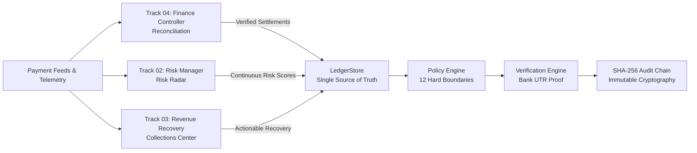
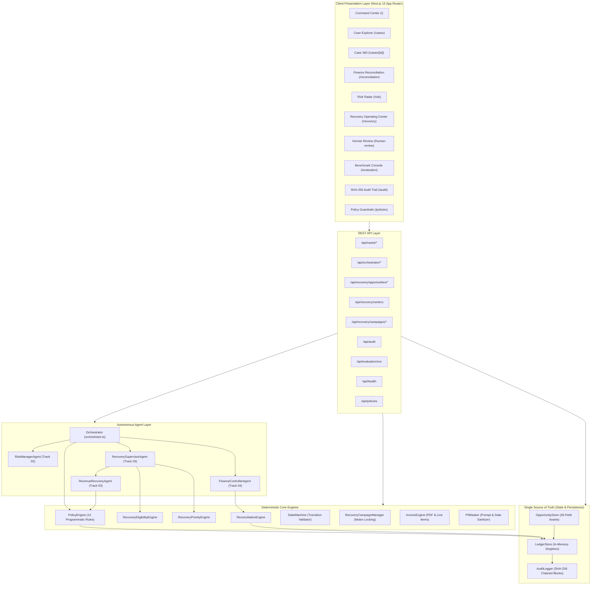

# RazorRisk.AI

<div align="center">

[](LICENSE)
[](https://nextjs.org/)
[](https://react.dev/)
[](https://www.typescriptlang.org/)
[](tests/)
[]()
[](https://nodejs.org/)

**Autonomous FinOps, Multi-Signal Risk Radar & Revenue Recovery Operating Center**

*Bridge the gap between raw payment telemetry, fraud risk scoring, multi-channel recovery, and cryptographic audit verification.*

[Key Features](#key-features) • [System Architecture](#system-architecture) • [The 10 Operating Centers](#the-10-recovery-operating-centers) • [Installation](#installation-guide) • [API Reference](#api-documentation) • [Demo Walkthrough](#demo-walkthrough)

</div>

---

## Overview

**RazorRisk.AI** is an enterprise-grade autonomous financial operations platform designed for high-scale payment ecosystems (such as Razorpay, UPI, Net Banking, Cards, and B2B Invoicing). 

Traditional payment systems suffer from disjointed tools: reconciliation spreadsheets, manual debt collection queues, and siloed fraud detectors. When transactions fail or invoices age, companies lose millions to involuntary churn, uncollected receivables, and undetected fraud.

RazorRisk.AI solves this by orchestrating **three independent operational workspaces** governed by a deterministic programmatic Policy Engine, an immutable SHA-256 audit ledger, and a closed-loop verification pipeline:

> ### The Core Fintech Law
> **LLM DECIDES.**  
> **CODE ENFORCES.**  
> **LEDGER STORES STATE.**  
> **RECONCILIATION VERIFIES REAL OUTCOMES.**  
> **AUDIT LOG RECORDS EVERYTHING.**

---

## Why This Matters

1. **Reconciliation Overhead**: Modern digital platforms process millions of payments across multiple banking switches. Manually resolving MDR fee netting, timing delays, and fuzzy UTR joins costs thousands of operational hours.
2. **Disconnected Risk & Collections**: Blindly recovering bad debts without multi-signal fraud screening risks collecting on compromised instruments or enabling credit card probing attacks.
3. **Unbounded Agent Hallucinations**: Standard LLM agent workflows risk offering unapproved discounts, violating customer contact cooldowns, or counting promises as actual cash.
4. **Accounting Integrity**: Misrepresenting partial collections or counting customer payment promises as verified revenue destroys accounting ledger integrity.

---

## The Three Operational Tracks



* **Track 04: Finance Controller & Reconciliation** (*"What happened to the money?"*):
  - **Deterministic 1:1 Exact Matching**: Zero-AI-cost short-circuiting for standard matches.
  - **MDR Fee Netting**: Automatic calculation of 1.5%–2.5% gateway fees + 18% GST.
  - **Structured AI Triage**: AI tool calls for ambiguous UTRs, fuzzy bank narrations, and timing discrepancies.
  - **Re-Reconciliation**: Closed-loop verification confirming that recovered settlements match bank UTR credits.

* **Track 02: Risk Manager & Multi-Signal Radar** (*"Is this safe / legitimate?"*):
  - **Continuous 0–100 Feature-Weighted Risk Scoring**: Evaluates velocity bursts, device clusters, dispute ratios, and card probing.
  - **Hard Policy Gate**: Risk Score $\ge 70$ strictly blocks recovery; $40–69$ escalates to Human Review; $<40$ approves.

* **Track 03: Revenue Recovery Operating Center** (*"How should we collect money that is legitimately owed?"*):
  - **First-Class RecoveryOpportunity Domain**: 28-field asset tracking with root-cause strategy mapping and 4-phase action plans (`CURRENT`, `NEXT`, `FALLBACK`, `STOP CONDITION`).
  - **10 Dedicated Operating Centers**: Specialized workflows for all financial obligation classes.
  - **Strict Partial Collection Accounting**: Enforces the invariant:
    $$\text{Verified Collected} + \text{Remaining Balance} = \text{Original Receivable}$$

---

## The 10 Recovery Operating Centers

| Center | Target Obligation Type | Specialist Agent | Primary Strategy | Guardrails & Policy |
|---|---|---|---|---|
| **01. Promise-to-Pay** | Customer payment commitments | `COLLECTIONS_AGENT` | Grace period lock & reminder | Auto-recycles on broken promise |
| **02. Partial Collections** | Partial payment (e.g. ₹60K of ₹100K) | `COLLECTIONS_AGENT` | Record partial UTR, keep residual active | Never premature `SETTLED_VERIFIED` |
| **03. Invoice Operations** | B2B Commercial Invoices | `INVOICE_AGENT` | PDF generation + Razorpay B2B link | Max 3 reminders, 24h interval |
| **04. Payment Links** | Consumer / SMB failed checkout & drops | `PAYMENT_AGENT` | WhatsApp / SMS Instant UPI link | Cooldown window 2h, Idempotent |
| **05. B2B Aging Center** | Overdue commercial receivables (15–90+d) | `INVOICE_AGENT` | Aging bucket dunning + early pay discount | Policy cap $\le 10\%$ discount |
| **06. Subscriptions** | Recurring SaaS / membership charges | `SUBSCRIPTION_RECOVERY_AGENT` | Smart retry + Card update portal link | Dunning cadence 1, 3, 5 days |
| **07. Mandates** | UPI AutoPay & e-Mandate drops | `MANDATE_RECOVERY_AGENT` | NPCI window retry + one-time link | Switch retry window alignment |
| **08. Checkout Drops** | High-intent cart abandonments | `COLLECTIONS_AGENT` | WhatsApp 1-click cart recovery | Bounded incentive $\le 5\%$ |
| **09. Voice Simulator** | High-ticket phone collections | `VOICE_RECOVERY_AGENT` | Multilingual dialogue (EN/HI/Hinglish) | Auto-records promise-to-pay |
| **10. Negotiation Center** | Large enterprise invoices ($\ge$ ₹50K) | `NEGOTIATION_AGENT` | 2-round bounded discount settlement | Min 85% settlement floor |

---

## System Architecture



---

## Deterministic Policy Engine (12 Programmatic Guardrails)

No AI agent can bypass the **12 Programmatic Guardrails** enforced by [`PolicyEngine`](docs/POLICY_ENGINE_SPEC.md):

1. **Rule 1 — Hard Risk Threshold**: Prohibits recovery on cases with Risk Score $\ge 70$.
2. **Rule 2 — Maximum Retries**: Hard ceiling of 3 retries per case.
3. **Rule 3 — Contact Cooldown**: Minimum 4 hours between automated customer contacts.
4. **Rule 4 — Maximum Discount Cap**: Clamped strictly to $\le 10.0\%$ ($1000$ bps).
5. **Rule 5 — Minimum Settlement Floor**: Minimum recovery amount enforced at $\ge 85.0\%$.
6. **Rule 6 — Auto-Recovery Exposure Ceiling**: Single cases $>$ ₹50,000 require human authorization.
7. **Rule 7 — Channel Authorization**: Contacts only through merchant-approved channels.
8. **Rule 8 — Daily Contact Cap**: Maximum 2 outbound contacts per customer per 24 hours.
9. **Rule 9 — Campaign Budget Ceilings**: Total campaign discount bounded by allocated budget.
10. **Rule 10 — Bounded Negotiation Rounds**: Maximum 2 rounds of counter-offers.
11. **Rule 11 — Promise-to-Pay Grace Lock**: Prohibits collections while promise is in active grace.
12. **Rule 12 — Human Sovereign Override**: Human operator decisions override autonomous AI.

---

## Tech Stack

| Layer | Technology | Purpose |
|---|---|---|
| **Frontend** | **Next.js 15.2.0 (App Router)** | High-performance React server and client components |
| **UI & Styling** | **Tailwind CSS 4.0 + Lucide Icons** | Custom enterprise design system with light/dark tokens |
| **Type Safety** | **TypeScript 5.7.3 + Zod 3.24** | End-to-end schema validation and static typing |
| **Testing** | **Vitest 3.0.7** | 427 unit, integration, and E2E evaluation benchmark tests |
| **AI LLM Layer** | **Google Gemini / Continuous Model** | Hybrid AI provider with deterministic continuous fallback |
| **Payments** | **Razorpay Test API Adapter** | Sandbox payment link creation & HMAC webhook verification |
| **Documents** | **PDFKit 0.20** | Automated commercial B2B tax invoice PDF generation |
| **Cryptography** | **Node.js `crypto` (SHA-256)** | Immutable hash-chained audit logging and verification |

---

## Folder Structure

```
RazorRisk.AI/
├── src/
│   ├── agents/               # Autonomous specialist agents & orchestrator
│   │   ├── finance-controller/  # Track 04: Reconciliation exception triage
│   │   ├── risk-manager/        # Track 02: Multi-signal risk assessment
│   │   ├── recovery-supervisor/ # Track 03: Specialist router & portfolio discovery
│   │   ├── revenue-recovery/    # Track 03: Multi-channel recovery & negotiation
│   │   └── orchestrator.ts      # Closed-loop end-to-end FinOps pipeline
│   ├── app/                  # Next.js 15 App Router pages & 14 API routes
│   │   ├── api/                 # REST API route handlers
│   │   ├── audit/               # /audit (Cryptographic audit log)
│   │   ├── cases/               # /cases & /cases/[id] (Case Explorer & 360 Detail)
│   │   ├── evaluation/          # /evaluation (Benchmark runner & scorecard)
│   │   ├── human-review/        # /human-review (Human escalation queue)
│   │   ├── policies/            # /policies (Policy configuration)
│   │   ├── reconciliation/      # /reconciliation (Track 04 Workspace)
│   │   ├── recovery/            # /recovery (Track 03 Operating Center)
│   │   ├── risk/                # /risk (Track 02 Workspace)
│   │   ├── layout.tsx           # Root shell layout with navigation
│   │   └── page.tsx             # / (Command Center Dashboard)
│   ├── components/           # Reusable UI component library (RRCard, RRButton, RRBadge, etc.)
│   ├── core/                 # Core domain logic, engines, stores, and providers
│   ├── data/synthetic/       # 48 scenario families, PRNG, fraud rings (50,000+ cases)
│   └── types/                # TypeScript domain definitions (986 lines)
├── docs/                     # Detailed architecture, API references, and judge guides
├── scripts/                  # One-click verification and benchmark scripts
├── tests/                    # 34 automated test files (427 tests passing)
├── .github/workflows/        # GitHub Actions CI/CD pipeline
├── Dockerfile                # Multi-stage production container build
├── docker-compose.yml        # Containerized deployment config
└── package.json              # Project dependencies and npm scripts
```

---

## Installation Guide

### Prerequisites
* **Node.js**: $\ge 18.17.0$ (LTS recommended)
* **npm**: $\ge 9.0.0$

### 1. Clone the Repository
```bash
git clone https://github.com/InTroVerT2627/RazorRisk.AI.git
cd RazorRisk.AI
```

### 2. Install Dependencies
```bash
npm install
```

### 3. Configure Environment (Optional)
```bash
cp .env.example .env.local
```
*(No API keys required for offline development; deterministic simulation mode is active by default.)*

### 4. Run Development Server
```bash
npm run dev
```
Open [http://localhost:3000](http://localhost:3000) in your browser.

---

## Deployment Guide (Vercel Production)

RazorRisk.AI is fully optimized for **Vercel** serverless deployment with automatic zero-configuration detection:

### 1. Import Project to Vercel
1. Go to [Vercel Dashboard](https://vercel.com/new) and import `https://github.com/InTroVerT2627/RazorRisk.AI`.
2. **Framework Preset**: `Next.js` (automatically detected).
3. **Root Directory**: `./` (leave default).
4. **Build Command**: `next build` (or leave default).
5. **Install Command**: `npm install`.

### 2. Configure Environment Variables (Optional)
In **Project Settings → Environment Variables**, add:
* `GEMINI_API_KEY`: *(Optional)* Your Google AI Gemini API Key for live LLM inference.
* `RAZORPAY_KEY_ID`: *(Optional)* Razorpay Sandbox Key ID for live test payments.
* `RAZORPAY_KEY_SECRET`: *(Optional)* Razorpay Sandbox Key Secret.
* `RAZORPAY_WEBHOOK_SECRET`: *(Optional)* Razorpay Sandbox Webhook Secret.

*(If no variables are configured, RazorRisk.AI runs with 100% feature completeness using its built-in deterministic simulation models and auto-seeded demo portfolio.)*

### 3. Click Deploy
Vercel will compile all 22 static and dynamic routes into serverless functions and edge assets.

---

## Verification & Testing

RazorRisk.AI includes a comprehensive test suite of **427 tests across 34 test files**:

```bash
# Run all automated unit, integration, and E2E tests
npm run test

# Run TypeScript static typechecker (0 errors)
npx tsc --noEmit

# Compile Next.js production build (22 routes)
npm run build
```

---

## API Documentation

RazorRisk.AI provides 14 REST API endpoints across 11 route files:

| Method | Endpoint | Description |
|---|---|---|
| `GET` | `/api/cases` | List and search FinOps cases with multi-factor filtering |
| `GET` | `/api/cases/[id]` | Get 360-degree case detail with linked transactions & audit |
| `POST` | `/api/cases` | Create manual financial exception case |
| `GET` | `/api/recovery/opportunities` | List recovery opportunities across the 10 centers |
| `GET` | `/api/recovery/opportunities/[id]` | Get single recovery opportunity by ID |
| `POST` | `/api/recovery/opportunities/[id]/action` | Execute operator action on opportunity |
| `GET` | `/api/recovery/centers` | Summary metrics across all 10 Operating Centers |
| `GET` | `/api/recovery/campaigns` | List autonomous recovery campaigns |
| `POST` | `/api/recovery/campaigns` | Create autonomous recovery campaign |
| `POST` | `/api/recovery/campaigns/[id]/run` | Execute autonomous campaign with mutex lock |
| `POST` | `/api/orchestrator/run` | Execute full FinOps pipeline on synthetic dataset |
| `POST` | `/api/orchestrator/human-action` | Human operator decision (Approve, Block, Override, Write-Off) |
| `GET` | `/api/audit` | Fetch sequential SHA-256 hash-chained audit events |
| `POST` | `/api/evaluation/run` | Run empirical benchmark against hidden ground truth |
| `GET` / `POST` | `/api/policies` | Fetch or update active merchant policy guardrails |
| `GET` | `/api/health` | Deep diagnostic system health monitor |

*See [`docs/API_REFERENCE.md`](docs/API_REFERENCE.md) for full request/response schemas.*

---

## Demo Walkthrough

### 1. Command Center (`/`)
Monitor high-level operational KPIs, real-time pipeline status, and track summaries.

### 2. Track 04: Finance Controller (`/reconciliation`)
Observe zero-AI-cost exact matching and automatic MDR fee netting (1.5%–2.5% + 18% GST).

### 3. Track 02: Risk Radar (`/risk`)
Inspect continuous 0–100 risk scores and multi-signal feature contributions (velocity bursts, device clusters, card probing).

### 4. Track 03: Revenue Recovery Operating Center (`/recovery`)
Navigate the 10 dedicated operating centers, interactive 9-stage funnel, and slide-over opportunity detail drawer with 4-phase action plans.

### 5. Human Review Escalation (`/human-review`)
Review evidence packets for borderline cases ($40–69$ risk score) and execute sovereign operator overrides.

### 6. Cryptographic SHA-256 Audit Log (`/audit`)
Inspect the immutable hash chain from Genesis and click **Verify Audit Integrity** to cryptographically validate all blocks.

---

## Security & PII Protection

* **Zero Direct Execution**: AI agents can never mutate financial ledger state without programmatic Policy Engine authorization.
* **PII Masking**: Card numbers, phone numbers, and emails are masked before entering LLM contexts (`PIIMasker`).
* **Cryptographic Chaining**: Every decision and transition is hashed sequentially using SHA-256 from genesis.
* **Ground Truth Anti-Leakage**: Evaluation benchmark cryptographically strips scenario labels before agent ingestion.
* **Webhook HMAC-SHA256**: All gateway webhooks verify cryptographic signatures.

---

## License

This project is licensed under the MIT License - see the [LICENSE](LICENSE) file for details.
