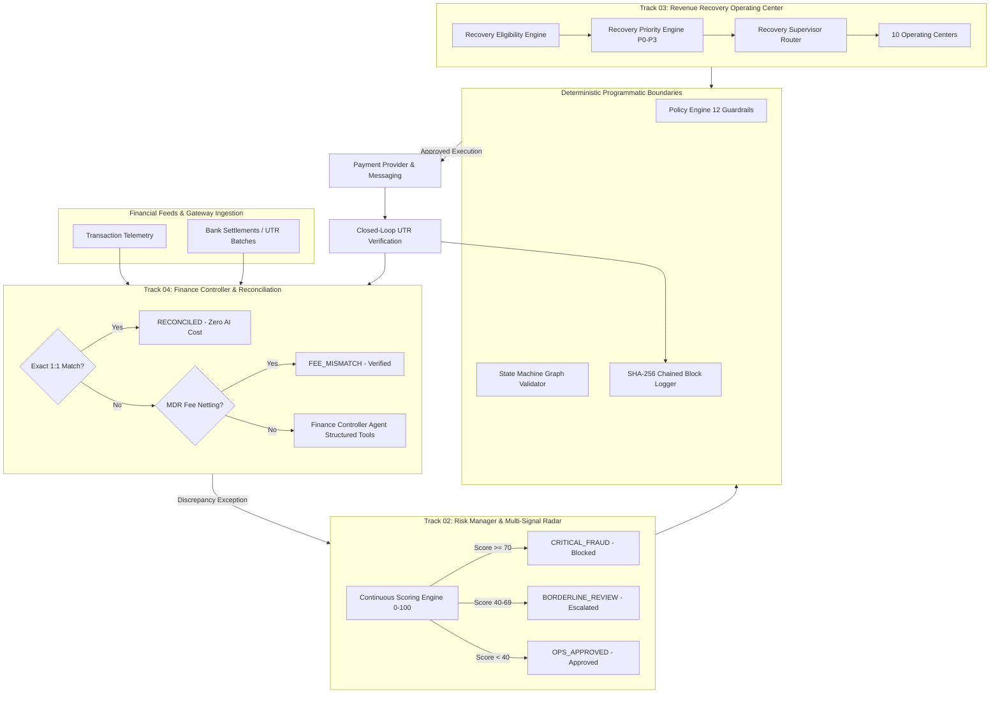
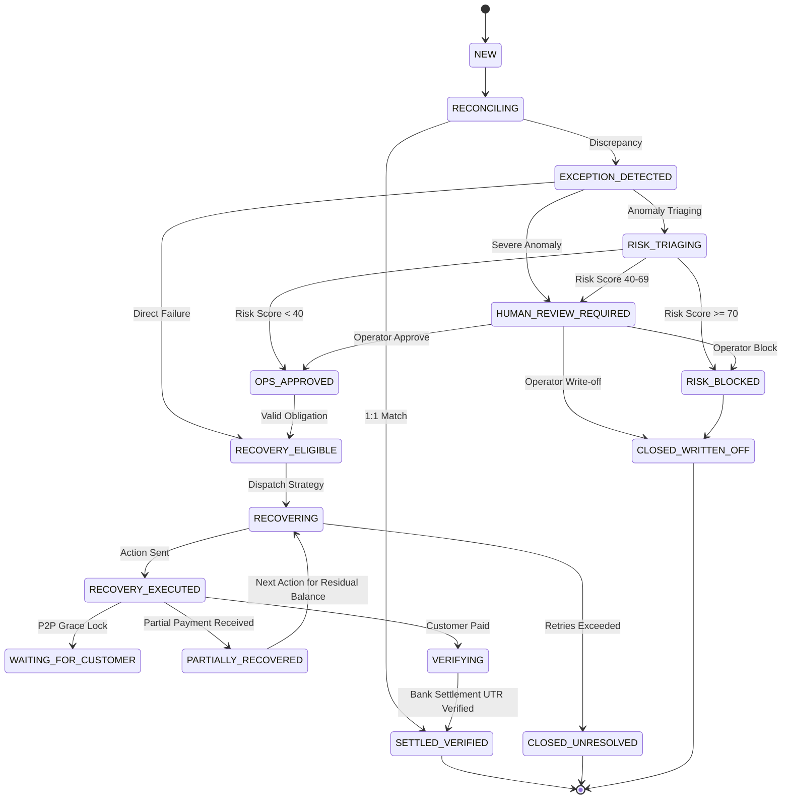

# RazorRisk.AI — Technical Architecture & Domain Model

## 1. Executive Conceptual Model
RazorRisk.AI operates on three independent operational workspaces governed by an immutable policy engine and cryptographic audit chain:

* **Track 04: Finance Controller / Reconciliation**: *"What happened to the money?"*
* **Track 02: Risk Manager**: *"Is this safe / legitimate?"*
* **Track 03: Revenue Recovery Operating Center**: *"How should we collect money that is legitimately owed?"*

---

## 2. The 10 Recovery Operating Centers
1. **Promise-to-Pay Center**: Manages customer payment commitments, locks grace periods, and auto-recycles broken promises into the active decision queue.
2. **Partial Collections Center**: Tracks partial collections, strictly enforcing: $\text{Verified Collected} + \text{Remaining Balance} = \text{Original Receivable}$.
3. **Invoice Operations Center**: Issues commercial B2B invoices with PDF rendering, GST calculation, and embedded payment links.
4. **Payment Links Center**: Tracks payment link lifecycle: `CREATED` $\rightarrow$ `DELIVERED` $\rightarrow$ `VIEWED` $\rightarrow$ `PAID` / `EXPIRED`.
5. **B2B Aging Center**: Categorizes overdue accounts into 15–30d, 31–60d, 61–90d, and 90+d aging brackets with automated early-settlement incentive triggers.
6. **Subscription Recovery Center**: Handles SaaS recurring drops (`AUTOPAY`, card expired `54`) with smart retries and secure card update links.
7. **Mandate Recovery Center**: Retries UPI AutoPay and e-mandates aligned with NPCI banking switch windows.
8. **Checkout Drop-Off Center**: Recovers high-intent abandoned carts with 1-click WhatsApp payment nudges and bounded incentives ($\le 5\%$).
9. **Voice Recovery Simulator**: Multi-lingual recovery dialogues in English, Hindi, and Hinglish (`"Friday ko kar dunga"`).
10. **Negotiation Center**: Executes bounded 2-round settlement protocol for B2B accounts ($\ge$ ₹50,000) enforcing policy discount caps ($\le 10\%$) and minimum settlement floors ($\ge 85\%$).

---

## 3. Formal State Machine Specification

